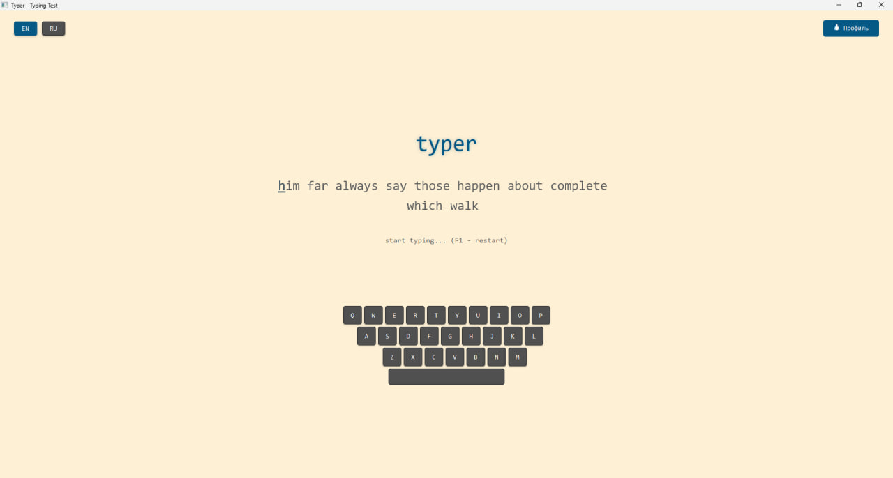
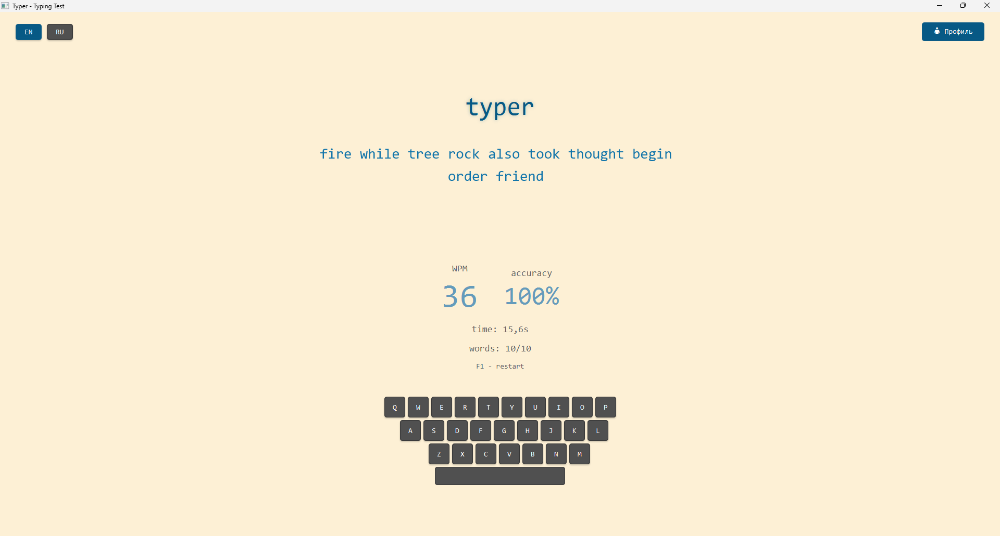
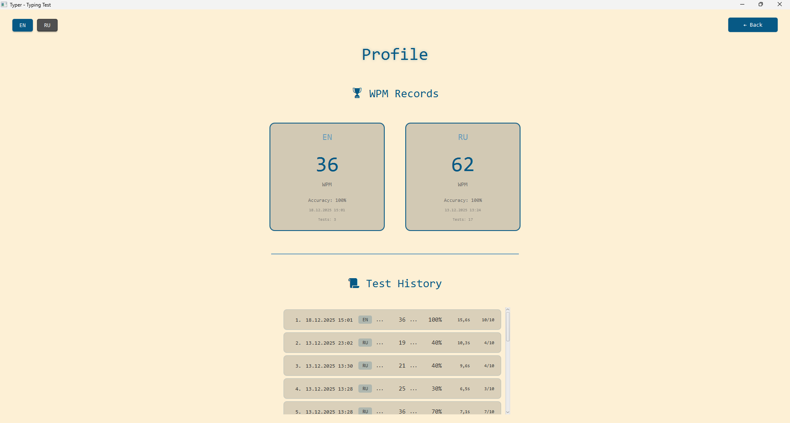
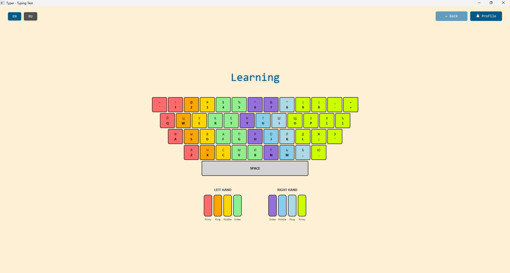

# INTERNATIONAL INFORMATION TECHNOLOGY UNIVERSITY

# PROJECT REPORT

## Typer - Typing Speed Test Application

**Students Names:** Kadirbekov Yerassyl, Ismagulov Ruslan, Magauiya Abay
**Group:** IT3-2502 MCM
**Submission Date:** December 20, 2025

---

## Introduction

In the modern digital era, typing proficiency has become an essential skill for effective computer interaction and professional productivity. The ability to type quickly and accurately is particularly crucial for students, professionals, and anyone working extensively with computers. This project addresses the need for an accessible, feature-rich typing practice tool that not only measures typing speed but also provides comprehensive tracking and analysis capabilities.

The development of this application was motivated by the recognition that existing typing test solutions often lack multi-language support, visual feedback mechanisms, or comprehensive progress tracking features. This project aims to fill this gap by providing a desktop application that combines real-time performance measurement, visual keyboard feedback, and persistent user profile management.

---

## Project Title: Typer - Typing Speed Test Application

**Description:** Typer is a desktop application designed for typing speed assessment and training, developed using Java and the JavaFX framework. The application provides users with an interactive interface for testing typing speed, measuring accuracy, and tracking progress over time. The system supports both English and Russian languages, incorporates real-time visual keyboard highlighting, and maintains a comprehensive profile system for storing test history and statistics.

The application employs modern UI/UX principles, featuring smooth animations, intuitive controls, and clear visual feedback to enhance the user experience and facilitate effective typing practice.

---

## Project Objectives

The primary objective of this project is to develop a comprehensive typing speed test application with a modern, intuitive user interface that supports multiple languages and provides detailed performance analytics.

The application enables users to:

1. **Test typing speed** in both English and Russian languages with randomly generated word sets
2. **Monitor typing accuracy** in real-time with immediate visual feedback on correct and incorrect input
3. **View performance statistics** including Words Per Minute (WPM) and accuracy percentage
4. **Maintain persistent test history** with the ability to review progress across multiple sessions
5. **Access personal records** with separate tracking for each supported language
6. **Utilize visual keyboard display** with real-time key highlighting to support touch-typing skill development
7. **Experience smooth, animated interface** with professional transitions and modern design elements
8. **Access interactive learning mode** with color-coded keyboard visualization showing proper finger placement for each key

---

## Application Interface

### Main Testing Screen



**Main Screen Description:**

The primary interface consists of several key components arranged in a clean, focused layout:

- **Top Navigation Bar:** Contains language selection toggles (EN/RU) positioned on the left and a profile access button on the right
- **Application Title:** Large "typer" heading with subtle shadow effects for visual depth
- **Word Display Area:** Central focus area showing the word sequence with color-coded feedback:
  - Gray text indicates words awaiting input
  - Blue text highlights correctly typed characters and words
  - Red text with underlining marks typing errors
  - Underlined character indicates current cursor position
- **Instruction Label:** Context-sensitive guidance ("start typing..." or "F1 - restart")
- **Visual Keyboard:** Interactive keyboard display with real-time highlighting of pressed keys
- **Smooth Animations:** Character-by-character animations provide immediate feedback during typing

### Results Display Screen



**Results Screen Description:**

Upon test completion, the interface transitions to display comprehensive performance metrics:

- **WPM Display:** Large, prominently positioned Words Per Minute score with animated counter
- **Accuracy Percentage:** Clearly displayed accuracy metric as a percentage
- **Time Elapsed:** Test duration shown in seconds with decimal precision
- **Word Statistics:** Ratio of correctly typed words to total word count
- **Restart Instruction:** Clear guidance for initiating a new test (F1 key)
- **Entrance Animation:** Results appear with coordinated fade-in and scaling effects

### User Profile Screen



**Profile Screen Description:**

The profile interface provides comprehensive access to historical performance data:

- **Personal Records Section:** Displays best performance metrics for each language:
  - Highest WPM achievement
  - Accuracy percentage of record test
  - Date and time of record establishment
  - Total number of tests completed in each language
- **Test History Section:** Scrollable list showing the most recent 15 test results with details:
  - Sequential numbering
  - Date and time of completion
  - Language indicator
  - WPM and accuracy metrics
  - Test duration
  - Correct word ratio
- **Smooth Transitions:** Animated navigation between main screen and profile view

### Learning Screen



**Learning Screen Description:**

The learning interface provides an interactive keyboard visualization to help users develop proper typing technique:

- **Interactive Keyboard Display:** Full keyboard layout with color-coded keys indicating which finger should be used:
  - Red keys: Left pinky finger
  - Orange keys: Left ring finger
  - Yellow keys: Left middle finger
  - Green keys: Left index finger
  - Purple keys: Right index finger
  - Light blue keys: Right middle finger
  - Sky blue keys: Right ring finger
  - Yellow-green keys: Right pinky finger
- **Hand Visualization:** Visual representation of both hands below the keyboard with matching color coding for each finger
- **Real-Time Key Animation:** When keys are pressed, they animate with scaling and brightening effects
- **Bilingual Support:** Keyboard automatically switches between QWERTY and ЙЦУКЕН layouts based on selected language
- **Complete Key Coverage:** Includes all alphanumeric keys, symbols, and spacebar with proper finger assignments
- **Finger Labels:** Each finger is labeled (Pinky, Ring, Middle, Index) for clarity

---

## Project Features

### 1. User-Friendly Interface

The application employs modern design principles to ensure an optimal user experience:

- **Minimalist Design:** Clean layout utilizing a carefully selected color palette with beige background (#FDF0D5) and blue accent colors (#075985, #669bbc)
- **Real-Time Visual Feedback:**
  - Color-coded input validation (blue for correct, red for errors)
  - Underlined text for incorrect words
  - Cursor position indicator on current character
- **Smooth Animations:** All interactive elements feature professional animations:
  - Fade-in and fade-out transitions
  - Scale animations for button interactions
  - Pulsating effects for selected elements
  - Drop shadow effects for visual depth
  - Animated WPM counter in results display
- **Intuitive Controls:** Keyboard-based navigation with clear shortcuts (F1 for restart)

### 2. Bilingual Support

Comprehensive multi-language functionality:

- **Language Switching:** Seamless toggle between English and Russian with a single click
- **Adaptive Keyboard Layout:** Visual keyboard automatically adjusts between QWERTY (English) and ЙЦУКЕН (Russian) layouts
- **Language-Specific Word Pools:**
  - 240+ commonly used English words
  - 200+ commonly used Russian words
- **Localized Interface Elements:** All labels and instructions adapt to the selected language

### 3. Visual Keyboard Display

Interactive keyboard visualization enhances learning:

- **Comprehensive Key Display:** Visual representation of all letter keys and spacebar
- **Real-Time Highlighting:** Keys illuminate as they are pressed:
  - Color change to accent color (#075985)
  - Scale animation (press and release)
  - Smooth color transition
- **Layout Adaptation:** Keyboard layout switches between QWERTY and ЙЦУКЕН based on selected language
- **Extended Spacebar:** Visually prominent 250-pixel wide spacebar representation
- **Visual Depth:** Shadow effects applied to each key for three-dimensional appearance
- **Touch-Typing Support:** Aids in developing muscle memory for blind typing

### 4. Interactive Learning Mode

Dedicated learning interface to master proper typing technique:

- **Color-Coded Keyboard Visualization:** Complete keyboard display with finger-specific color coding:
  - 🔴 **Red** — Left pinky (Q, A, Z, 1, `, !)
  - 🟠 **Orange** — Left ring finger (W, S, 2, @)
  - 🟡 **Yellow** — Left middle finger (E, D, X, 3, #)
  - 🟢 **Green** — Left index finger (R, T, F, G, V, B, 4, 5, $, %)
  - 🟣 **Purple** — Right index finger (Y, H, N, 6, 7, ^, &)
  - 🔵 **Light Blue** — Right middle finger (U, J, M)
  - 🟦 **Sky Blue** — Right ring finger (I, K, 8, *, ,, <)
  - 🟨 **Yellow-Green** — Right pinky (O, L, P, 9, 0, -, =, [, ], ;, ', /, ?, .)
- **Animated Key Presses:** Real-time visual feedback when keys are pressed:
  - Scale animation (key visually presses down)
  - Color brightening effect
  - Smooth transition animations
- **Hand Visualization:** Graphical representation of both hands with color-coded fingers matching the keyboard
- **Finger Labels:** Clear labeling (Pinky, Ring, Middle, Index) for each finger
- **Dual Language Support:** Automatic keyboard layout switching between English (QWERTY) and Russian (ЙЦУКЕН)
- **Complete Symbol Coverage:** All letters, numbers, and common symbols included with proper finger assignments
- **Professional Component Design:** Implemented as separate `KeyboardGuide` class for modularity and reusability

### 5. Data Persistence

Robust data management ensures reliable storage and retrieval:

- **Automatic Saving:** All test results are automatically persisted to disk
- **User Directory Storage:** Data stored in user's home directory (~/.typer/results.dat)
- **Java Serialization:** Utilizes Java's built-in serialization mechanism for object persistence
- **Directory Management:** Automatically creates data directory on first run
- **Comprehensive Metadata:** Each test record includes:
  - Words Per Minute (WPM)
  - Accuracy percentage
  - Test duration in seconds
  - Number of correctly typed words
  - Total word count
  - Language identifier
  - Timestamp (LocalDateTime)

### 6. Profile Management System

Advanced user profile functionality:

- **Complete History Tracking:** All test results stored with timestamps
- **Language-Specific Statistics:**
  - Best WPM for each language
  - Highest accuracy for each language
  - Average WPM calculation
  - Average accuracy calculation
  - Total test count per language
- **Recent History Display:** Shows the 15 most recent test results with full details
- **Record Visualization:** Personal bests displayed in dedicated card components
- **Formatted Date Display:** Timestamps formatted as dd.MM.yyyy HH:mm
- **Scrollable History List:** Vertical scrolling for test history navigation

### 6. Error Handling

Comprehensive error management ensures application stability:

- **Input Validation:** Accepts only alphabetic characters for typing input
- **Special Key Handling:** Ignores Tab and other non-typing keys
- **Visual Error Indication:** Incorrect input immediately highlighted in red
- **Overflow Display:** Extra characters beyond word length shown as errors
- **Language Lock:** Prevents language switching during active test
- **File System Exception Handling:**
  - IOException handling for directory creation
  - IOException handling for data save/load operations
  - ClassNotFoundException handling for deserialization
- **Error Logging:** Clear error messages output to stderr for debugging

### 7. Metrics and Statistics

Professional-grade performance measurement:

- **Words Per Minute (WPM):** Industry-standard typing speed metric
  - Calculation: (correct characters / 5) / time in minutes
- **Accuracy Percentage:** Precision measurement of typing correctness
  - Calculation: (correct words / total words) × 100
- **Time Measurement:** Elapsed time displayed with 0.1 second precision
- **Word Counting:** Tracking of both correct and total word counts
- **Progress Tracking:** Historical data enables long-term progress monitoring

---

## Technology Stack

**Programming Language:** Java 21  
**GUI Framework:** JavaFX 21  
**Development Environment:** IntelliJ IDEA / Visual Studio Code  
**Build System:** Apache Maven 3.x  
**Java Development Kit:** Oracle JDK 21 / OpenJDK 21  

**Technologies and Libraries:**
- **JavaFX Controls** — UI components (Label, Button, TextFlow, ScrollPane)
- **JavaFX Animation** — Smooth animations (FadeTransition, ScaleTransition, Timeline)
- **JavaFX Effects** — Visual enhancements (DropShadow)
- **Java Collections Framework** — Data structures (ArrayList, HashMap, List)
- **Java Streams API** — Functional data processing and filtering
- **Java Serialization** — Object persistence mechanism
- **Java NIO** — Modern file system operations (Files, Paths)
- **Java Time API** — Date and time handling (LocalDateTime, DateTimeFormatter)

**Architectural Patterns:**
- **MVC-Like Structure** — Separation of logic and presentation layers
- **Service Layer Pattern** — ProfileService for data access abstraction
- **Data Transfer Object** — TestResult for encapsulating test data

---

## Implementation Steps

### 1. Project Setup

**Maven Project Configuration:**
```xml
<groupId>com.typer</groupId>
<artifactId>typer</artifactId>
<version>1.0-SNAPSHOT</version>
```

**JavaFX Dependencies:**
- Added `javafx-controls` version 21
- Added `javafx-fxml` version 21

**Java 21 Configuration:**
- Set `maven.compiler.source` to version 21
- Set `maven.compiler.target` to version 21
- Project encoding: UTF-8

**JavaFX Maven Plugin Configuration:**
```xml
<plugin>
    <groupId>org.openjfx</groupId>
    <artifactId>javafx-maven-plugin</artifactId>
    <configuration>
        <mainClass>com.typer.TyperApp</mainClass>
    </configuration>
</plugin>
```

**Package Structure:**
```
com.typer/
├── Main.java (alternative entry point)
├── TyperApp.java (main application class)
├── KeyboardGuide.java (learning mode keyboard component)
├── ProfileService.java (data management service)
└── TestResult.java (data model)
```

### 2. GUI Design

**Main Window Structure:**
- Utilized `BorderPane` as root layout container
- Window dimensions: 1600×900 pixels
- Color scheme:
  - Background: #FDF0D5 (beige)
  - Primary accent: #075985 (dark blue)
  - Secondary accent: #669bbc (light blue)
  - Correct text: #1275aa (blue)
  - Error text: #9c0000 (red)
  - Pending text: #616161 (gray)

**Top Navigation Bar:**
- HBox container with language toggles on the left
- ToggleGroup for mutually exclusive language selection
- Profile button positioned on the right

**Central Content Area:**
- VBox with vertical alignment
- Label for "typer" title (48pt Consolas font)
- TextFlow for word display with per-character styling
- Label for contextual instructions
- Label for statistics (hidden until test completion)
- VBox for results display (hidden until test completion)
- VBox for visual keyboard representation

**Profile Screen:**
- Separate VBox, toggled with main screen
- Profile header
- Record cards for English and Russian
- ScrollPane containing test history list

**Learning Screen:**
- Separate VBox component utilizing KeyboardGuide class
- Title label with shadow effects
- ScrollPane for keyboard visualization
- Interactive keyboard with color-coded keys (55×55px each)
- Hand visualization with finger color mapping
- Real-time key press animations

**Visual Keyboard:**
- VBox with 4 rows (3 letter rows + spacebar)
- Each key represented by a Label (40×40px)
- HashMap for efficient key lookup by character

### 3. Logic Implementation

**Word Generation:**
```java
private List<String> generateWords() {
    List<String> result = new ArrayList<>();
    Random random = new Random();
    for (int i = 0; i < WORD_COUNT; i++) {
        result.add(currentWordPool[random.nextInt(currentWordPool.length)]);
    }
    return result;
}
```
- Random selection of 10 words from pool (240 English or 200 Russian)
- New word set generated on each test restart

**User Input Processing:**
- `onKeyPressed` — Handles BACKSPACE, SPACE, F1, and key highlighting
- `onKeyTyped` — Appends characters to current input buffer
- `onKeyReleased` — Removes key highlighting

**Progress Tracking:**
```java
private int currentWordIndex = 0;
private StringBuilder currentInput = new StringBuilder();
private List<Boolean> wordResults = new ArrayList<>();
```

**Display Updates:**
- Per-character color coding (blue/red/gray)
- Current character underlining
- Animated appearance for each typed character

**Word Completion Processing:**
```java
private void processWordComplete() {
    String typed = currentInput.toString();
    String expected = words.get(currentWordIndex);
    boolean correct = typed.equals(expected);
    wordResults.add(correct);
    
    currentWordIndex++;
    currentInput.setLength(0);
    
    if (currentWordIndex >= words.size()) {
        finishTest();
    }
}
```

**Results Calculation:**
```java
int correctWords = 0;
int correctChars = 0;
for (int i = 0; i < words.size(); i++) {
    if (wordResults.get(i)) {
        correctWords++;
        correctChars += words.get(i).length();
    }
}

double minutes = timeSeconds / 60.0;
int wpm = (int) ((correctChars / 5.0) / minutes);
int accuracy = (int) ((correctWords * 100.0) / words.size());
```

**Result Persistence:**
```java
TestResult result = new TestResult(wpm, accuracy, timeSeconds, 
                                    correctWords, words.size(), isRussian);
profileService.saveResult(result);
```

**Profile Service Operations:**
- `saveResult()` — Adds result to collection and persists to file
- `loadResults()` — Loads results from file on application startup
- `getBestWpm()` — Retrieves best WPM for specified language
- `getAverageWpm()` — Calculates average WPM
- `getRecentResults()` — Fetches N most recent test results

### 4. Testing and Debugging

**Functional Testing:**
- Verified word generation correctness
- Tested input processing (letters, space, backspace)
- Validated WPM and accuracy calculations
- Confirmed result saving and loading functionality
- Tested language switching mechanism
- Verified keyboard highlighting accuracy
- Tested profile system functionality
- Confirmed animation smoothness

**Edge Case Handling:**
- Input exceeding word length (displayed in red)
- Language change attempt during active test (blocked)
- Missing data file on first run (automatic creation)
- Empty test history (appropriate message displayed)
- F1 key press during test (restart triggered)

**Performance Optimization:**
- Optimized TextFlow updates (only on changes)
- Utilized HashMap for O(1) key lookup performance
- Efficient result filtering using Stream API

**User Interface Testing:**
- Verified layout responsiveness at various window sizes
- Tested animation smoothness and timing
- Confirmed color scheme readability
- Validated font rendering (Consolas)

### 5. Application Enhancement

**Implemented Animations:**
- FadeTransition for smooth view transitions
- ScaleTransition for button pulsation effects
- ParallelTransition for combined animations
- Timeline for animated WPM counter
- Per-character appearance animations

**Visual Effects:**
- DropShadow for titles and buttons
- Underlined text for incorrect words
- Gradient color transitions
- Rounded corners (border-radius)

**User Experience Improvements:**
- Automatic completion of final word
- Visual feedback for every user action
- Contextual hints (F1 - restart)
- Russian language localization
- Scrollable test history
- Language-specific statistics separation

**Enhanced Statistics:**
- Total test count tracking
- Average metrics calculation
- Per-language record tracking
- Timestamped test history
- Detailed history with date sorting

---

## Source Code

### TyperApp.java (Main Application Class - Excerpt)
```java
public class TyperApp extends Application {
    // color
    private static final String BG_COLOR = "#FDF0D5";
    private static final String ACCENT_COLOR = "#075985ff";
    private static final String TEXT_CORRECT = "#1275aaff";
    private static final String TEXT_ERROR = "#9c0000ff";
    
    // word pools
    private static final String[] ENGLISH_WORDS = { /* 240 words */ };
    private static final String[] RUSSIAN_WORDS = { /* 200 words */ };
    
    // test state
    private List<String> words;
    private int currentWordIndex = 0;
    private StringBuilder currentInput = new StringBuilder();
    private List<Boolean> wordResults = new ArrayList<>();
    private long startTime = 0;
    private boolean testStarted = false;
    
    // ui
    private TextFlow wordsDisplay;
    private VBox resultBox;
    private VBox keyboardBox;
    private Map<String, Label> keyLabels = new HashMap<>();
    private ProfileService profileService;
    
    @Override
    public void start(Stage primaryStage) {
        profileService = new ProfileService();
        words = generateWords();
        
        // UI creation
        BorderPane root = new BorderPane();
        // ... component initialization ...
        
        // input handling
        scene.setOnKeyTyped(event -> {
            String character = event.getCharacter();
            if (Character.isLetter(character.charAt(0))) {
                if (!testStarted) {
                    testStarted = true;
                    startTime = System.currentTimeMillis();
                }
                currentInput.append(character.charAt(0));
                updateWordsDisplay();
            }
        });
        
        primaryStage.setScene(scene);
        primaryStage.show();
    }
    
    private void updateWordsDisplay() {
        wordsDisplay.getChildren().clear();
        
        for (int wordIdx = 0; wordIdx < words.size(); wordIdx++) {
            String word = words.get(wordIdx);
            
            if (wordIdx == currentWordIndex) {
                // display current word with color coding
                for (int charIdx = 0; charIdx < word.length(); charIdx++) {
                    Text charText = new Text(String.valueOf(word.charAt(charIdx)));
                    
                    if (charIdx < currentInput.length()) {
                        if (currentInput.charAt(charIdx) == word.charAt(charIdx)) {
                            charText.setFill(Color.web(TEXT_CORRECT));
                        } else {
                            charText.setFill(Color.web(TEXT_ERROR));
                        }
                    } else if (charIdx == currentInput.length()) {
                        charText.setUnderline(true); // Cursor
                    }
                    
                    wordsDisplay.getChildren().add(charText);
                }
            }
            // ... processing other words ...
        }
    }
    
    private void finishTest() {
        long endTime = System.currentTimeMillis();
        double timeSeconds = (endTime - startTime) / 1000.0;
        
        // metrics calculation
        int correctChars = /* calculation */;
        int wpm = (int) ((correctChars / 5.0) / (timeSeconds / 60.0));
        int accuracy = /* percentage calculation */;
        
        // result persistence
        TestResult result = new TestResult(wpm, accuracy, timeSeconds, 
                                            correctWords, words.size(), isRussian);
        profileService.saveResult(result);
        
        // display results with animation
        // ...
    }
}
```

### ProfileService.java (Data Management Service)
```java
public class ProfileService {
    private static final String DATA_DIR = System.getProperty("user.home") + "/.typer";
    private static final String RESULTS_FILE = DATA_DIR + "/results.dat";
    
    private List<TestResult> results;
    
    public ProfileService() {
        this.results = new ArrayList<>();
        ensureDataDirectory();
        loadResults();
    }
    
    public void saveResult(TestResult result) {
        results.add(result);
        saveResults();
    }
    
    private void saveResults() {
        try (ObjectOutputStream oos = new ObjectOutputStream(
                new FileOutputStream(RESULTS_FILE))) {
            oos.writeObject(results);
        } catch (IOException e) {
            System.err.println("Error saving results: " + e.getMessage());
        }
    }
    
    @SuppressWarnings("unchecked")
    private void loadResults() {
        File file = new File(RESULTS_FILE);
        if (!file.exists()) return;
        
        try (ObjectInputStream ois = new ObjectInputStream(
                new FileInputStream(file))) {
            results = (List<TestResult>) ois.readObject();
        } catch (IOException | ClassNotFoundException e) {
            System.err.println("Error loading results: " + e.getMessage());
            results = new ArrayList<>();
        }
    }
    
    public TestResult getBestWpm(boolean russian) {
        return results.stream()
                .filter(r -> r.isRussian() == russian)
                .max(Comparator.comparingInt(TestResult::getWpm))
                .orElse(null);
    }
    
    public List<TestResult> getRecentResults(int count) {
        return results.stream()
                .sorted(Comparator.comparing(TestResult::getTimestamp).reversed())
                .limit(count)
                .collect(Collectors.toList());
    }
}
```

### TestResult.java (Data Model)
```java
public class TestResult implements Serializable {
    private static final long serialVersionUID = 1L;
    
    private int wpm;
    private int accuracy;
    private double timeSeconds;
    private int correctWords;
    private int totalWords;
    private boolean isRussian;
    private LocalDateTime timestamp;
    
    public TestResult(int wpm, int accuracy, double timeSeconds, 
                      int correctWords, int totalWords, boolean isRussian) {
        this.wpm = wpm;
        this.accuracy = accuracy;
        this.timeSeconds = timeSeconds;
        this.correctWords = correctWords;
        this.totalWords = totalWords;
        this.isRussian = isRussian;
        this.timestamp = LocalDateTime.now();
    }
    
    public String getFormattedDate() {
        DateTimeFormatter formatter = DateTimeFormatter.ofPattern("dd.MM.yyyy HH:mm");
        return timestamp.format(formatter);
    }
    
    // getters...
}
```

### KeyboardGuide.java (Learning Mode Component - Excerpt)
```java
public class KeyboardGuide extends VBox {
    private Map<String, StackPane> keyButtons = new HashMap<>();
    private Map<String, String> fingerColors = new HashMap<>();
    private boolean isRussian;
    
    public KeyboardGuide(boolean isRussian) {
        this.isRussian = isRussian;
        setupColors();
        createKeyboardVisualization();
    }
    
    private void setupColors() {
        // Left hand color mapping
        fingerColors.put("Q", "#FF6B6B"); // Red - left pinky
        fingerColors.put("W", "#FFA500"); // Orange - left ring
        fingerColors.put("E", "#FFD700"); // Yellow - left middle
        fingerColors.put("R", "#90EE90"); // Green - left index
        // ... 100+ key mappings ...
    }
    
    private VBox createKeyboard() {
        // Creates full keyboard layout with color-coded keys
        // Each key is a StackPane with Rectangle background and Label text
        // Returns VBox containing 4 rows (3 letter rows + spacebar)
    }
    
    private HBox createHands() {
        // Creates visual representation of hands
        // Shows 4 fingers per hand with matching colors
        // Includes finger labels (Pinky, Ring, Middle, Index)
    }
    
    public void highlightKey(String key) {
        StackPane keyPane = keyButtons.get(key.toUpperCase());
        if (keyPane != null) {
            // Scale animation - press effect
            ScaleTransition scale = new ScaleTransition(Duration.millis(100), keyPane);
            scale.setToX(0.95);
            scale.setToY(0.95);
            scale.setAutoReverse(true);
            scale.setCycleCount(2);
            
            // Color brightening - highlight effect
            Rectangle bg = (Rectangle) keyPane.getChildren().get(0);
            FillTransition fill = new FillTransition(Duration.millis(100), bg);
            fill.setToValue(((Color) bg.getFill()).brighter());
            fill.setAutoReverse(true);
            fill.setCycleCount(2);
            
            new ParallelTransition(scale, fill).play();
        }
    }
}
```

**Complete project source code is available in the repository:**
- [TyperApp.java](typer/src/main/java/com/typer/TyperApp.java) — 1,100+ lines
- [KeyboardGuide.java](typer/src/main/java/com/typer/KeyboardGuide.java) — 350+ lines
- [ProfileService.java](typer/src/main/java/com/typer/ProfileService.java) — 114 lines
- [TestResult.java](typer/src/main/java/com/typer/TestResult.java) — 65 lines
- [pom.xml](typer/pom.xml) — Maven configuration

---

## Challenges and Solutions

### Challenge 1: TextFlow Update Performance
**Problem:** Each character input triggered complete recreation of all Text objects in the TextFlow, resulting in noticeable delays and degraded user experience.

**Solution:** Optimized the `updateWordsDisplay()` method with conditional rendering to update only modified portions of the display. Additionally, animations were applied exclusively to the most recently typed character, significantly reducing UI thread load and improving responsiveness.

### Challenge 2: Keyboard Highlighting for Russian Layout
**Problem:** Windows keyboard events return key codes corresponding to the English layout even when Russian input is active, causing incorrect key highlighting in the visual keyboard.

**Solution:** Implemented a solution using `event.getText()` instead of `event.getCode()` to capture the actual typed character. Created a HashMap with uppercase keys for unified lookup, enabling accurate highlighting regardless of the active keyboard layout.

### Challenge 3: LocalDateTime Serialization
**Problem:** Initial implementation used the legacy Date class, which presented issues with time zones and lacked modern API features.

**Solution:** Migrated to `java.time.LocalDateTime`, which implements Serializable and provides a modern, comprehensive API for date and time operations. Implemented a custom DateTimeFormatter for consistent, readable date display formatting.

### Challenge 4: Automatic Final Word Completion
**Problem:** After typing the final word, users were required to press the spacebar, which was not immediately obvious and created a confusing user experience.

**Solution:** Implemented a conditional check `currentWordIndex == words.size() - 1` in the `onKeyTyped` handler that automatically invokes `processWordComplete()` when the length of the final word is reached, providing a more intuitive test completion flow.

### Challenge 5: Animation Conflicts
**Problem:** Multiple simultaneous animations (fade, scale) occasionally conflicted, creating visual artifacts and inconsistent behavior.

**Solution:** Utilized `ParallelTransition` for synchronized animations and `SequentialTransition` for sequential effects. Implemented `setOnFinished()` callbacks to properly clean up state after animation completion, ensuring consistent visual behavior.

### Challenge 6: Cross-Platform Data Directory Creation
**Problem:** Hardcoded paths using forward slashes did not function correctly on Windows systems.

**Solution:** Implemented cross-platform compatibility using `System.getProperty("user.home")` for platform-independent home directory access and `Files.createDirectories()` from Java NIO for recursive directory creation.

### Challenge 7: Focus Loss After Button Interaction
**Problem:** After clicking language or profile buttons, keyboard input became non-functional due to focus loss.

**Solution:** Added `root.requestFocus()` calls after all UI interactions and set `root.setFocusTraversable(true)` on the root element to ensure keyboard focus is properly maintained throughout the application lifecycle.

---

## Conclusion

This project successfully developed a comprehensive desktop application for typing speed assessment named **Typer**. The application demonstrates effective utilization of modern Java technologies and JavaFX framework capabilities for creating interactive, professional-grade user interfaces.

**Achieved Objectives:**
1. Successfully implemented a bilingual typing speed trainer (English/Russian)
2. Created an interactive visual keyboard with real-time key highlighting
3. Developed a comprehensive profile system with persistent test history
4. Designed a modern, animated interface with smooth transitions
5. Implemented accurate performance metrics (WPM, Accuracy)
6. Ensured cross-platform compatibility and data persistence
7. Developed an interactive learning mode with color-coded finger placement visualization

**Skills Acquired:**
- Advanced JavaFX UI development and component composition
- Implementation of animations and visual effects
- Real-time keyboard event processing
- File system operations and object serialization
- Stream API utilization for collection processing
- Application of software design patterns (MVC, Service Layer)
- UI application performance optimization

**Practical Applications:**
The application serves multiple practical purposes:
- Self-directed touch-typing skill development
- Typing speed improvement and practice
- Professional preparation for typing-intensive careers (administrative assistant, writer, programmer)
- Personal progress monitoring and goal setting

**Future Enhancement Opportunities:**
- Additional language support (Kazakh, Spanish, German, French)
- Specialized training modes (home row, top row, numbers, symbols)
- Multiplayer functionality for competitive typing
- Statistics export to CSV/PDF formats
- Customizable theme system
- Cloud storage integration for cross-device synchronization
- Audio feedback for keypress events
- Historical WPM progress visualization graphs
- Difficulty levels with varying word complexity
- Custom word list import functionality

This project has demonstrated the importance of careful user interface design, comprehensive error handling, and efficient data management in desktop application development. The experience and knowledge gained through this project will prove valuable in future software development endeavors, particularly in the domain of user-facing desktop applications.

The successful completion of this project has provided hands-on experience with industry-standard development tools, modern programming patterns, and professional software engineering practices that will serve as a strong foundation for continued growth as a software developer.

---

## Appendices

### Screenshots

**Note:** For comprehensive project presentation, it is recommended to capture actual application screenshots and place them in the `screenshots/` directory:
- `main_screen.png` — Main testing screen
- `typing_process.png` — Active typing session
- `results_screen.png` — Results display screen
- `profile_screen.png` — Profile screen with history
- `learning_screen.png` — Learning screen with interactive keyboard
- `keyboard_highlight.png` — Keyboard highlighting demonstration

### Execution Instructions

**System Requirements:**
- Java Runtime Environment 21 or higher
- Apache Maven 3.6 or higher

**Build and Execution Commands:**
```bash

cd c:\dev\typerPROJECT\typer

# build
mvn clean compile

# run
mvn javafx:run

# alternative run in Windwos
run.bat
```

**Application Controls:**
- `Keyboard` — Text input
- `Space` — Complete current word
- `Backspace` — Delete last character
- `F1` — Restart test
- `EN/RU` — Language selection (available before test start)
- `Learning Button` — Navigate to interactive learning screen
- `Profile Button` — Navigate to profile screen

---

**Submission Date:** December 20, 2025  

---
